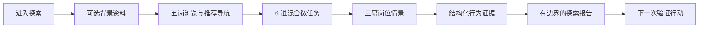
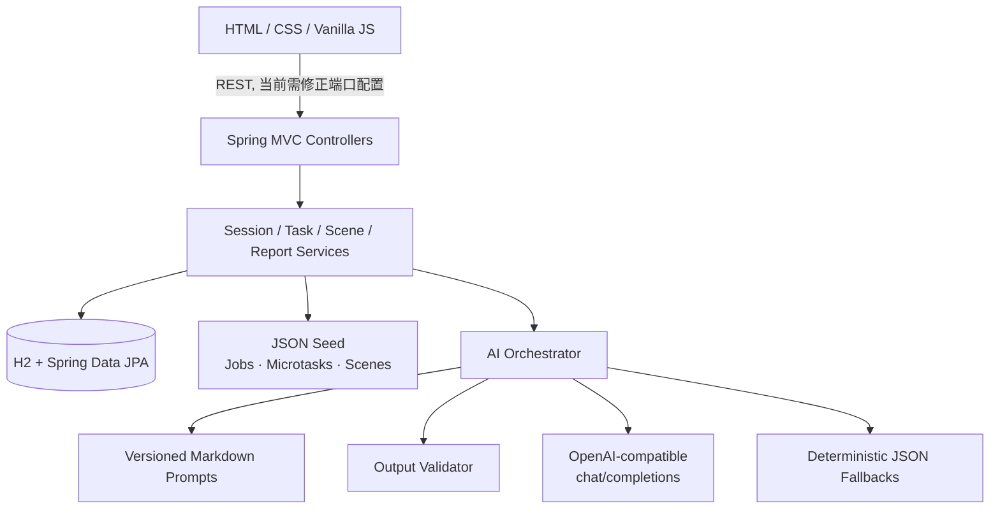

# WAYVE｜先体验，再决定职业方向

> 面向 AI 时代转岗者的证据型职业探索原型：先完成岗位微任务与情景判断，再基于本次可观察行为生成有边界的探索报告。


WAYVE 坚持四条产品原则：**Preview before Commit**、**Recommendation ≠ Assessment**、**Evidence over Labels**、**Deterministic Core + LLM**。它不是心理测评、招聘筛选器或“职业适配度”判定工具；它帮助用户用一次低成本体验换取下一步更具体的验证方向。

## 评审 30 秒速览

| 评分维度 | 本仓库中的回答 |
| --- | --- |
| 问题洞察与价值 · 20% | 把“我适合哪个 AI 岗位？”改写为“我愿意继续做哪类真实工作、现有证据支持什么、还缺什么证据？” |
| 创新性 · 20% | 推荐只负责导航；微任务与三幕情景负责观察；报告保留证据来源、置信度与结论边界。确定性评分不交给模型。 |
| 后续发展潜力 · 20% | 当前 Scenario Quiz 可逐步迁移到 Work Sample、Collaboration Evidence、Evidence Replay 与 Growth Track，而无需改变核心证据原则。 |
| Demo 完成度 · 15% | 五岗均有可交互微任务，五岗 × 三幕情景脚本、场景证据接口、报告接口与离线 fallback 已进入代码。 |
| 技术实现能力 · 15% | Spring Boot 3.4.1、Java 17、H2/JPA、OpenAPI、静态前端、结构化 Prompt、输出校验、OpenAI-compatible Chat Completions。 |
| 展示表达与协作 · 10% | 3 分钟演示路径、架构图、证据索引与 Current/Future 边界集中在本文；产品 SOT 拆分在 `docs/product/`。 |

## 真问题

职业转换者通常只能看到岗位描述、课程目录和抽象标签，却很难在承诺数月学习或求职之前回答三个问题：

1. 这个岗位每天究竟在处理什么对象、做什么取舍？
2. 我在接近真实的约束下会如何行动，而不只是如何自我描述？
3. 一次短体验能支持哪些判断，又有哪些仍然未知？

WAYVE 不用一份问卷替用户下结论，而是缩短从“想象岗位”到“获得第一份行为证据”的距离。

## WAYVE 如何解决



- **岗位先被体验，而不是先被承诺。** 用户可在五个方向之间切换，并进入每个岗位的任务入口。
- **证据先于标签。** 微任务选择、场景回答、用户主观反馈分别保留来源，报告只描述本轮观察。
- **推荐不等于评价。** 背景推荐用于缩小探索入口，不进入岗位能力评分。
- **确定性内核约束模型。** 题目、选项分值、状态推进、雷达换算和固定选项证据由代码/seed 决定；LLM 处理受限的结构化提取与叙事。

## 核心创新

### 1. 从“匹配”改为“验证”

产品不输出永久能力、人格或职业 fit，而是给出本轮体验中的观察、限制与下一步实验。用户保留最终职业决定权。

### 2. 两类可组合的观察入口

- **Microtask：** 每岗题库含 4 组、共 24 道选择题；一次任务随机混合抽取 6 道，记录答案并生成维度雷达。
- **Scene：** 每岗覆盖会议、客户/用户、发布/交付三幕，共 15 份脚本；固定选项读取 authored preset，自由回答进入受限 AI 证据提取。

### 3. 可降级的 AI，而非 AI 单点依赖

启用 AI 时，`LlmClient` 通过 `RestClient` 调用 OpenAI-compatible `POST /chat/completions`；未启用、无 Key、调用失败或输出校验失败时，`AiOrchestrator` 使用仓库内 JSON fallback。输出校验还限制不当的确定性职业结论。

## 当前已实现能力

| 能力 | Current runtime 证据 | 边界 |
| --- | --- | --- |
| 五岗探索 | AI 产品经理、AI 产品设计（UI/UX）、AI 产品运营、AI 用户研究、AI 解决方案顾问均为 `interactive` | 前端 ID 与后端 seed ID 通过映射兼容 |
| Microtask | 五岗题库、混合抽题、6 步会话、逐步提交、原始分与雷达分、兴趣反馈 | 属于 Scenario-based assessment，不是持久化 work sample |
| Scene API | 按 ID/岗位读取脚本、提交 preset/custom 回答、按 session 查询证据 | 当前是三幕情景观察，不是完整 Collaboration Sprint |
| Scene Evidence | preset 确定性证据；custom 由 AI 提取 observed behavior、summary、tags、confidence 并持久化 H2 | 单幕记录不代表岗位适配或稳定能力 |
| Report | 汇总背景、微任务、场景、兴趣与主观信号；生成报告、读取报告、选择目标岗位 | 当前报告不是完整 Evidence Replay 或长期画像 |
| AI Orchestrator | 背景提取、岗位推荐、场景证据、报告叙事、判断依据；Prompt + validator + fallback | AI 不拥有题库真值、状态机或评分真值 |
| Demo data | 固定 demo session 与报告 fallback | 演示数据不是用户或商业指标 |

产品侧使用五个 canonical ID：`ai_product`、`ai_ui_design`、`ai_ops`、`ai_data_eval`、`ai_app_dev`；后端当前分别映射到 `ai_pm`、`ai_ux`、`ai_operator`、`ai_researcher`、`ai_consultant`。

## Quick Start

### 前置条件

- JDK 17
- Maven 3.x（当前仓库未提交 Maven Wrapper JAR，因此干净 clone 请使用系统 `mvn`）

### 无在线模型启动

```powershell
git clone https://github.com/xiangRose/Wayve.git
cd Wayve
mvn spring-boot:run
```

启动后可访问：

- 页面：<http://localhost:3000/>
- 健康检查：<http://localhost:3000/api/v1/health>
- Swagger UI：<http://localhost:3000/swagger-ui.html>

后端会从仓库根目录提供 `front/` 静态资源，并使用文件型 H2 数据库。首次启动不需要 AI Key；AI 默认关闭并走 fallback。

> **当前联调说明：** 后端真实端口是 `3000`，但当前 `front/js/app.js` 的 API 基址仍指向 `3001`。因此页面静态资源可由 `3000` 打开，浏览器端会在 API 连接失败后进入本地演示分支；后端完整接口可通过 Swagger/HTTP 单独验证。此端口错配是当前代码事实，不在本文档 PR 中修改。

### AI 配置

复制示例配置并填写自己的密钥（`.env` 已被 Git 忽略）：

```powershell
Copy-Item .env.example .env
```

```dotenv
AI_ENABLED=true
AI_API_KEY=your_key_here
AI_BASE_URL=https://api.openai.com/v1
AI_MODEL_PRO=gpt-4o
```

| 变量 | 作用 | 默认行为 |
| --- | --- | --- |
| `AI_ENABLED` | 是否启用在线模型 | `false` |
| `AI_API_KEY` | Bearer API Key | 空；模型不可用 |
| `AI_BASE_URL` | OpenAI-compatible API 根地址 | `https://api.openai.com/v1` |
| `AI_MODEL_PRO` | Chat Completions 模型名 | `gpt-4o` |

请勿提交 `.env` 或真实密钥。服务会在 `AI_ENABLED=true` 且 Key 非空时调用 `${AI_BASE_URL}/chat/completions`。

## 3 分钟评委 Demo 路径

由于上述前端端口错配，当前最可复现的评审路径是“页面叙事 + Swagger API”双轨演示：

1. **0:00–0:30｜问题与入口**：打开首页，说明 Preview before Commit 与五岗平等探索。
2. **0:30–1:20｜Microtask**：展示任一岗位的 6 道混合微任务；在 Swagger 创建 session、task 并提交 step，观察进度与 radar 返回。
3. **1:20–2:10｜Scene Evidence**：读取该岗位三幕 scene，提交 preset 回答；说明 preset 为确定性证据、custom 才进入 LLM/fallback。
4. **2:10–2:40｜Report**：调用 report generate，展示任务雷达、行为依据、学习建议和边界声明。
5. **2:40–3:00｜边界与未来**：强调 Recommendation ≠ Assessment，并展示 Future 路线不是当前完成度声明。

建议无 Key 演示以验证确定性路径；在线模型演示前再配置 `.env`。

## 技术架构



关键设计是“模型可替换、证据边界不可绕过”：在线模型负责有限语言理解，业务状态、固定题目、评分换算、数据保存与 fallback 仍由应用层控制。

## 技术栈

- Java 17、Spring Boot 3.4.1、Spring MVC
- Spring Data JPA、H2 file database
- Springdoc OpenAPI 2.7.0 / Swagger UI
- `RestClient` + OpenAI-compatible Chat Completions
- HTML、CSS、Vanilla JavaScript
- JSON seed、Markdown prompts、JSON fallbacks

## Code Evidence Index

| Claim | Repository evidence |
| --- | --- |
| 端口与 AI 配置 | [`application.yml`](src/main/resources/application.yml) · [`.env.example`](.env.example) |
| 静态前端由 Spring 提供 | [`WebConfig.java`](src/main/java/com/Grassroot/JobSearch/config/WebConfig.java) |
| 五岗定义与状态 | [`jobs.json`](src/main/resources/seed/jobs.json) · [`app.js`](front/js/app.js) |
| 五岗 Microtask 题库 | [`microtask-bank.json`](src/main/resources/seed/microtask-bank.json) · [`MicrotaskBankService.java`](src/main/java/com/Grassroot/JobSearch/task/MicrotaskBankService.java) |
| 任务会话与雷达 | [`TaskService.java`](src/main/java/com/Grassroot/JobSearch/task/TaskService.java) · [`TaskController.java`](src/main/java/com/Grassroot/JobSearch/task/TaskController.java) |
| 15 个三幕场景 | [`scene-scripts/`](src/main/resources/seed/scene-scripts/) · [`SceneController.java`](src/main/java/com/Grassroot/JobSearch/scene/SceneController.java) |
| 场景证据持久化 | [`SceneEvidenceService.java`](src/main/java/com/Grassroot/JobSearch/scene/SceneEvidenceService.java) · [`SceneEvidence.java`](src/main/java/com/Grassroot/JobSearch/scene/SceneEvidence.java) |
| 报告生成与边界 | [`ReportService.java`](src/main/java/com/Grassroot/JobSearch/report/ReportService.java) · [`ReportContextBuilder.java`](src/main/java/com/Grassroot/JobSearch/ai/ReportContextBuilder.java) |
| 真实模型调用 | [`LlmClient.java`](src/main/java/com/Grassroot/JobSearch/llm/LlmClient.java) · [`AiOrchestrator.java`](src/main/java/com/Grassroot/JobSearch/ai/AiOrchestrator.java) |
| Prompt 与 fallback | [`AI/prompts/`](AI/prompts/) · [`AI/fallbacks/`](src/main/resources/AI/fallbacks/) |
| API 契约 | [`openapi.yaml`](docs/openapi.yaml) · [`backend-p0-selftest.md`](docs/backend-p0-selftest.md) |
| 产品事实源 | [`docs/product/README.md`](docs/product/README.md) · [`product-overview.md`](docs/product/product-overview.md) |

## 后续发展潜力

当前结构为以下能力留下了清晰迁移点，但这些不是已交付功能：

- 将 Scenario Quiz 扩展为岗位专属、可编辑工作对象的 Role Work Sample。
- 引入共享世界的 Collaboration Sprint，并独立保存 Collaboration Evidence。
- 把重要报告 claim 回放到 source event、用户 action、consequence、interpretation、confidence 与 limits。
- 将一次报告扩展为用户可修订的 Working Portrait 与长周期 Growth Track。
- 让 Next Mission 来自 evidence gap / unknown，并在后续真实实验中更新状态。

## 产品边界

WAYVE 当前只讨论“本次任务中观察到了什么”。它不：

- 宣称用户适合或不适合某个岗位；
- 从兴趣、背景或一次行为推断稳定人格与永久能力；
- 把未观察到等同于低分；
- 让 LLM 发明行为证据或改写确定性评分真值；
- 把演示 seed 当成真实用户、市场或商业指标。

## Current / Future Scope

| Current（代码已运行） | Future / Post-MVP（产品 SOT 或迁移目标） |
| --- | --- |
| 五岗浏览与交互入口 | 完整 Role Work Sample 与 persistent work object |
| 每岗 24 道 Microtask 题库、每轮混合 6 题 | canonical Behavior Event 全量持久化与 deterministic consequence chain |
| 五岗 × 三幕 Scene API 与 Scene Evidence 持久化 | Collaboration Sprint 与独立 Collaboration Evidence |
| preset 证据、custom LLM/fallback 提取 | 完整 Evidence Replay |
| 单次探索报告、任务雷达、行为依据与边界说明 | 可修订 Working Portrait、完整 Reflection 流程 |
| H2 中的 session/task/scene/report 数据 | 长周期 Growth Track、Persistent Work Sample 与跨体验趋势 |
| Next Mission/成长方向的展示性内容 | 基于后续真实实验推进的持久 Next Mission 生命周期 |

产品 SOT 中出现的 Collaboration、Working Portrait、Replay、Growth Track 等契约不等于当前 runtime 已完成；README 以代码事实为 Current 标准。

## Repository Structure

```text
.
├── AI/prompts/                       # 结构化模型提示词
├── docs/
│   ├── openapi.yaml                  # REST API 契约
│   └── product/                      # Current Product SOT 与 Future 边界
├── front/
│   ├── assets/                       # 页面、岗位、场景与报告素材
│   ├── css/styles.css
│   ├── index.html
│   └── js/app.js
├── src/main/java/com/Grassroot/JobSearch/
│   ├── ai/                           # 编排、Prompt、校验与报告上下文
│   ├── llm/                          # OpenAI-compatible 客户端
│   ├── scene/                        # 场景目录与证据
│   ├── task/                         # Microtask 会话、评分与雷达
│   └── report/                       # 探索报告
├── src/main/resources/
│   ├── AI/fallbacks/                 # 可演示的结构化降级输出
│   ├── seed/                         # 岗位、题库、场景与 demo seed
│   └── application.yml
└── pom.xml
```

更完整的产品语义与边界从 [`docs/product/README.md`](docs/product/README.md) 开始阅读。
