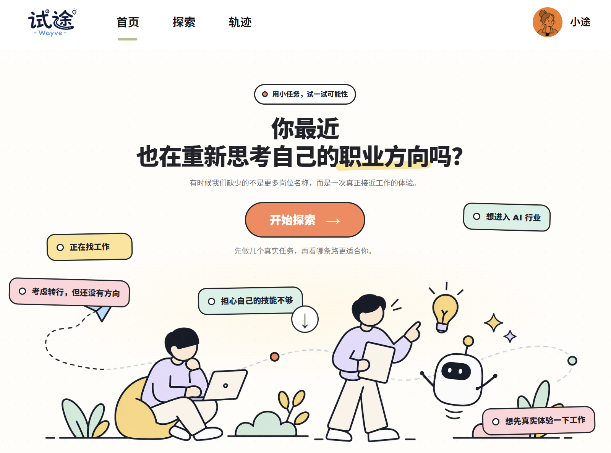
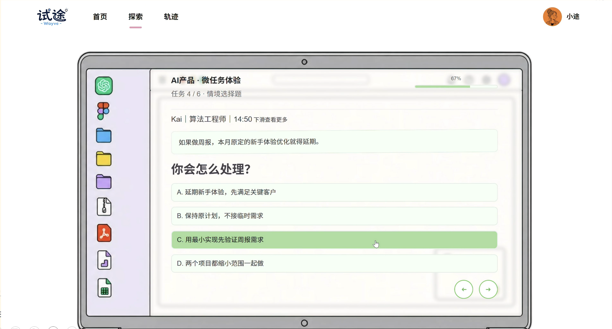
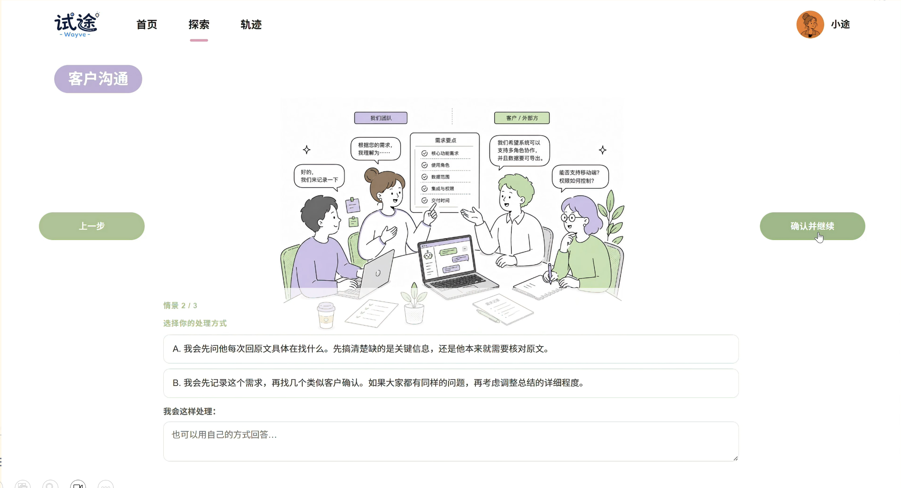
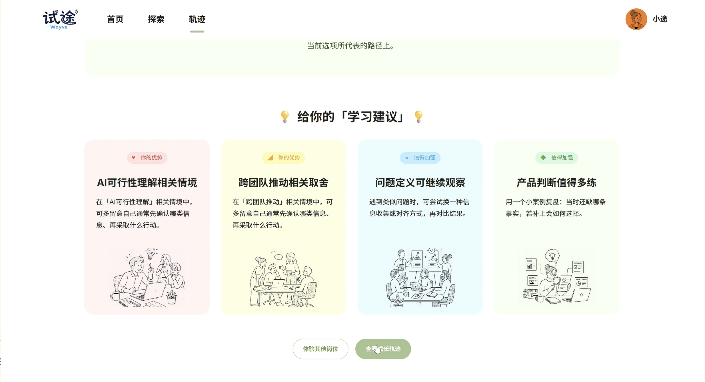
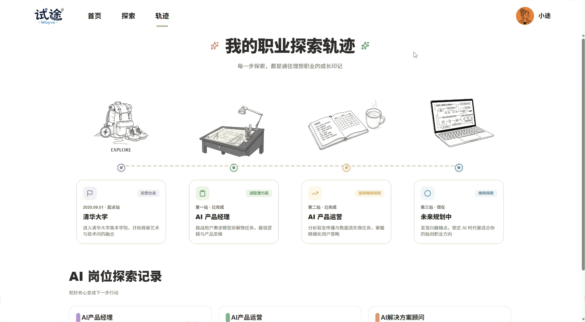
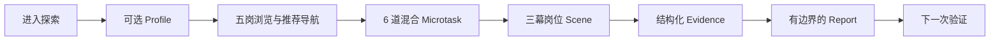
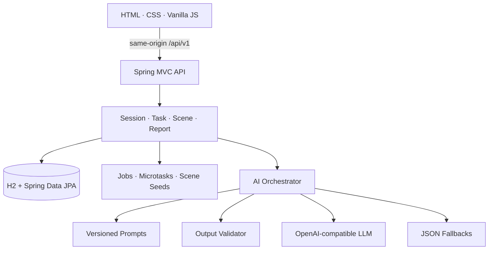

# 试途 WAYVE

<p align="center">
  <strong>仕途之前，先「试途」。</strong><br />
  <strong>Preview before Commit.</strong><br /><br />
  用几分钟体验一段真实工作，再决定这条职业方向值不值得继续验证。<br />
  面向学生、初入职场用户，以及正在转岗或转行的人。
</p>

<p align="center">
  
</p>

WAYVE 是一个体验式职业探索产品。它不先问“你适合什么”，而是先让你做一小段接近真实的工作；体验结束后，再根据本轮行为与感受，帮助你决定下一步值得继续探索什么。

> **Evidence, not Verdicts.** 一次体验提供证据，不替任何人作出职业判决。

## What is WAYVE?

WAYVE 让职业方向从一段描述，变成一次可以亲自进入的体验：先选一个方向，完成短任务和工作情景，再回看自己如何理解问题、使用证据和作出取舍。

它不是心理测评、简历匹配、招聘筛选或职业 fit 判定。背景与推荐只帮助用户找到探索入口；真正的反馈来自本轮任务中可观察的行为，并始终保留结论边界。

## Why WAYVE｜从“看 / 测 / 聊”到“试”

知道一份 JD，**不等于体验过这份工作**。

职业探索并不只缺信息，更缺一次低成本、可逆、接近真实工作的验证机会：招聘网站告诉人“岗位需要什么”，问卷依赖“我如何描述自己”，AI 对话则主要根据已有信息作推断。WAYVE 增加第四种动作——先做一小段，再观察自己实际如何判断。

| 看 | 测 | 聊 | **试** |
| --- | --- | --- | --- |
| 阅读岗位要求 | 回答自我描述 | 获取个性化建议 | 进入任务与情景 |
| 知道“它是什么” | 推测“我是什么样” | 推测“可能适合什么” | 获得“我刚才怎么做”的证据 |

> **不是多给一个答案，而是多给一次判断的依据。**

## Product Experience

### 01 · 真实任务｜先做一次

用户不先回答“你觉得自己适合这个岗位吗”，而是进入具体工作问题，在需求、证据、约束与目标之间作出选择。系统观察本轮选择，并按 authored dimension 汇总任务雷达。

<p align="center">
  
</p>

### 02 · 场景模拟｜进入现场

用户依次面对会议、客户或用户、发布或交付三类情景。固定选项产生预先编写的 evidence；自由回答进入受限的结构化提取。这一步把抽象自评变成有上下文的行为观察。

<p align="center">
  
</p>

### 03 · 行为反馈｜看见自己怎么做

报告汇总任务、场景、兴趣和用户主观信号，呈现观察依据、学习建议与结论边界。一次体验可以暴露值得继续验证的方向，但不会生成永久能力或职业 fit。

<p align="center">
  
</p>

### 04 · 下一步｜把答案变成新实验

当前页面把本轮结果收束为下一次探索方向。长期、跨体验的轨迹系统仍是 Future；截图表达的是产品愿景入口，不代表纵向证据系统已经完整运行。

<p align="center">
  
</p>

## How It Works



这是当前可运行的 MVP 主路径。完整 Work Sample、Collaboration Sprint、Evidence Replay 与长期 Growth Track 属于 Future / Post-MVP。

## What Makes WAYVE Different

### Preview before Commit

在投入长期学习、求职或转行之前，先完成一段短而具体的岗位体验。

### Recommendation ≠ Assessment

背景资料和岗位推荐只用于导航，不改变任务结果，也不作为能力证据。

### Evidence over Labels

系统描述“在什么情景下做了什么、这能支持什么、仍缺什么”，不把一次体验压缩成人格或适配度标签。

### Deterministic Core + LLM

题库、选项、状态推进、分值换算、preset evidence 与持久化由应用层控制。LLM 负责有限的自由文本提取和报告叙事；输出不合法或模型不可用时进入已版本化 fallback。

## What Works Today

| Capability | Current runtime evidence | Boundary |
| --- | --- | --- |
| **Five roles** | 五个 canonical 产品方向均有 interactive 入口；前后端保留兼容 ID 映射 | runtime 历史命名不重新定义 Product SOT |
| **Microtask** | 每岗 4 组、共 24 题；一次 session 混合抽取 6 题，逐步保存答案并生成维度雷达 | 当前是 Scenario-based assessment，不是可编辑 Work Sample |
| **Scene** | 五岗各 3 幕，共 15 个脚本；支持按 ID/岗位读取及提交回答 | 三幕岗位情景不等于完整 Collaboration Sprint |
| **Scene Evidence** | preset 读取 authored evidence；custom 经 AI/fallback 提取 observation、summary、tags、confidence，并按 session 写入 H2 | 单幕证据不能推出稳定能力或岗位适配 |
| **Report** | 生成/读取报告、选择目标岗位；汇总 task radar、scene evidence、interest、主观信号、判断依据和 boundary notice | 不是完整 Evidence Replay 或 Working Portrait |
| **LLM** | `RestClient` 调用 OpenAI-compatible `POST /chat/completions`，支持 JSON mode | 模型不拥有业务状态、题库与评分真值 |
| **Fallback** | AI 关闭、无 Key、调用失败、空响应或输出校验失败时读取仓库 JSON fallback | fallback 是确定性演示/降级数据，不是用户数据 |
| **Persistence** | H2 file database + Spring Data JPA 保存 session、task、interest、scene evidence 与 report | 尚非跨体验的长期证据系统 |

产品层 canonical role IDs 为：`ai_product`、`ai_ui_design`、`ai_ops`、`ai_data_eval`、`ai_app_dev`。当前 runtime 为兼容既有 seed，分别映射到 `ai_pm`、`ai_ux`、`ai_operator`、`ai_researcher`、`ai_consultant`；产品界面上的显示名称来自当前岗位 seed。

## Hackathon Snapshot

WAYVE 当前以 Hackathon MVP 的形式验证核心产品闭环。以下把现有产品与工程证据对应到比赛关注的六个维度。

| Dimension | WAYVE today |
| --- | --- |
| **问题洞察与价值 · 20%** | 把“我适合什么”改写为“我体验了什么、产生了什么证据、下一步还要验证什么”，降低职业探索第一次试错的成本。 |
| **创新性 · 20%** | 推荐只负责导航；Microtask 与 Scene 负责观察；报告保留证据边界。确定性题目、状态和 authored scoring 不交给模型随意决定。 |
| **后续发展潜力 · 20%** | Scenario-based MVP 已拆出 session、task、scene、evidence、report 与 AI 边界，可继续演进为 Work Sample、Replay 和跨体验成长系统。 |
| **Demo 完成度 · 15%** | Spring Boot 在 3000 同时提供前端与 API；五岗均有交互入口、微任务、三幕情景、行为证据与报告页面，可沿产品页面端到端演示。 |
| **技术实现能力 · 15%** | Java 17、Spring Boot 3.4.1、H2/JPA、REST、OpenAPI、结构化 Prompt、输出校验、Chat Completions 与 JSON fallback 均有实现。 |
| **展示表达与团队协作 · 10%** | 五张真实产品截图、3 分钟演示路径、架构图、Code Evidence Index 与 Current/Future 表让产品、设计和工程事实可以快速定位。 |

## Quick Start

### Requirements

- Git
- JDK 17
- 首次使用 Maven Wrapper 时可访问其 Maven distribution 地址

### Clone and run

```bash
git clone https://github.com/xiangRose/Wayve.git
cd Wayve
```

Windows：

```powershell
.\mvnw.cmd spring-boot:run
```

macOS / Linux：

```bash
./mvnw spring-boot:run
```

打开：

- 产品页面：<http://localhost:3000/>
- 健康检查：<http://localhost:3000/api/v1/health>
- Swagger UI：<http://localhost:3000/swagger-ui.html>

Spring Boot 从仓库根目录直接提供 `front/`。页面由 3000 打开时，API 使用当前 origin 的 `/api/v1`；若前端在 3001 或 5173 单独开发，则请求 `http://localhost:3000/api/v1`，对应来源已列入 CORS。

Maven Wrapper 配置使用 Maven 3.9.16 的 only-script distribution 模式，因此无需在仓库提交 wrapper JAR。首次运行会按 `.mvn/wrapper/maven-wrapper.properties` 下载 distribution。

## AI Configuration

AI 默认关闭，未配置 Key 也可以使用 fallback 完成演示。需要在线模型时复制示例配置：

```powershell
Copy-Item .env.example .env
```

```dotenv
AI_ENABLED=true
AI_API_KEY=your_key_here
AI_BASE_URL=https://api.openai.com/v1
AI_MODEL_PRO=gpt-4o
```

| Variable | Purpose | Application default |
| --- | --- | --- |
| `AI_ENABLED` | 开启在线模型调用 | `false` |
| `AI_API_KEY` | Bearer API Key | 空 |
| `AI_BASE_URL` | OpenAI-compatible API 根地址 | `https://api.openai.com/v1` |
| `AI_MODEL_PRO` | Chat Completions 模型名 | `gpt-4o` |

当 `AI_ENABLED=true` 且 Key 非空时，服务请求 `${AI_BASE_URL}/chat/completions`。请勿提交 `.env` 或真实密钥。

## 3-Minute Demo

1. **0:00–0:30｜问题与选岗**：从首页进入五岗探索，说明“先体验，再承诺”和 Recommendation ≠ Assessment。
2. **0:30–1:15｜Microtask**：选择一个岗位，完成几道混合微任务，展示真实工作判断而非抽象自评。
3. **1:15–2:00｜Scene**：进入三幕情景，展示 preset 选择与一次自由回答如何形成不同证据路径。
4. **2:00–2:35｜Evidence / Report**：完成体验并打开报告，展示任务雷达、行为依据、建议和 boundary notice。
5. **2:35–3:00｜边界与未来**：说明一次体验提供 evidence 而非 verdict，并展示从 Scenario MVP 演进到 Work Sample / Replay 的路径。

主 Demo 路径全部在产品页面中完成，Swagger 仅作为 technical verification。这也是推荐的 Hackathon 演示路径。

## Tech Architecture



模型处理语言任务；业务事实、状态推进、authored scoring、preset evidence 与 persistence 不由模型随意决定。`OutputValidator` 检查结构和禁用结论，失败后由 orchestrator 降级。

### Tech Stack

- Java 17 · Spring Boot 3.4.1 · Spring MVC
- Spring Data JPA · H2 file database
- Springdoc OpenAPI 2.7.0 · Swagger UI
- Spring `RestClient` · OpenAI-compatible Chat Completions
- HTML · CSS · Vanilla JavaScript
- JSON seed · Markdown prompts · JSON fallbacks

## Code Evidence Index

| Claim | Repository evidence |
| --- | --- |
| 端口、H2 与 AI 配置 | [`application.yml`](src/main/resources/application.yml) · [`.env.example`](.env.example) |
| 前端由 Spring Boot 提供 | [`WebConfig.java`](src/main/java/com/Grassroot/JobSearch/config/WebConfig.java) |
| 同源/开发端口 API base | [`app.js`](front/js/app.js) |
| 五岗定义与 interactive 状态 | [`jobs.json`](src/main/resources/seed/jobs.json) |
| canonical/runtime ID 映射 | [`app.js`](front/js/app.js) · [`JobIdMapper.java`](src/main/java/com/Grassroot/JobSearch/common/JobIdMapper.java) |
| Microtask 题库、抽样与雷达 | [`microtask-bank.json`](src/main/resources/seed/microtask-bank.json) · [`MicrotaskBankService.java`](src/main/java/com/Grassroot/JobSearch/task/MicrotaskBankService.java) · [`TaskService.java`](src/main/java/com/Grassroot/JobSearch/task/TaskService.java) |
| 15 个 Scene scripts 与 API | [`scene-scripts/`](src/main/resources/seed/scene-scripts/) · [`SceneController.java`](src/main/java/com/Grassroot/JobSearch/scene/SceneController.java) |
| Scene Evidence 持久化 | [`SceneEvidenceService.java`](src/main/java/com/Grassroot/JobSearch/scene/SceneEvidenceService.java) · [`SceneEvidence.java`](src/main/java/com/Grassroot/JobSearch/scene/SceneEvidence.java) |
| Report runtime | [`ReportController.java`](src/main/java/com/Grassroot/JobSearch/report/ReportController.java) · [`ReportService.java`](src/main/java/com/Grassroot/JobSearch/report/ReportService.java) |
| 模型调用与 AI 编排 | [`LlmClient.java`](src/main/java/com/Grassroot/JobSearch/llm/LlmClient.java) · [`AiOrchestrator.java`](src/main/java/com/Grassroot/JobSearch/ai/AiOrchestrator.java) |
| 输出约束与 fallback | [`OutputValidator.java`](src/main/java/com/Grassroot/JobSearch/ai/OutputValidator.java) · [`AI/fallbacks/`](src/main/resources/AI/fallbacks/) |
| API 契约 | [`openapi.yaml`](docs/openapi.yaml) · [`backend-p0-selftest.md`](docs/backend-p0-selftest.md) |
| Product SOT 与范围边界 | [`WAYVE-Product-PRD.md`](WAYVE-Product-PRD.md) · [`docs/product/README.md`](docs/product/README.md) · [`product-overview.md`](docs/product/product-overview.md) · [`behavior-and-evidence.md`](docs/product/behavior-and-evidence.md) |

## Current vs Future

| Current runtime | Future / Post-MVP / Migration Target |
| --- | --- |
| 五岗浏览、推荐导航与 interactive 入口 | 扩展更多岗位与经过验证的岗位研究数据 |
| 每岗 24 道 Microtask 题库、每轮混合 6 题 | Persistent Work Sample 与可编辑 work object |
| 五岗 × 三幕 Scene、preset/custom evidence | Collaboration Sprint 与独立 Collaboration Evidence |
| session/task/scene/report 的 H2 持久化 | canonical Behavior Event 全链路与跨体验持久化 |
| 单次任务雷达、行为依据、学习建议与边界声明 | 完整 Evidence Replay 与 Work Sample-based Hard Skill Assessment |
| 下一步探索内容与成长页面 | 可修订 Working Portrait、long-term Growth Track |

仓库中的产品设计文档描述了目标契约；只有已经进入当前代码运行路径的能力才列为 Current。

## Future Potential

未来不是简单增加更多问卷，而是逐步提高证据质量：

- **从 Scenario 到 Work Sample：** 复用现有 task/session 边界，引入可编辑 work object、consequence、revision 与 deliverable。
- **从 Evidence 摘要到 Replay：** 让重要 claim 回到 source event、user action、result、interpretation、confidence 与 limits。
- **从单人情景到 Collaboration Evidence：** 在共享状态中观察信息交换、分歧处理与最终承诺，同时与岗位专业证据分开保存。
- **从单次报告到成长系统：** 将用户确认过的反思、未知项和 Next Mission 连接成 Working Portrait 与 Growth Track，但不把历史压缩成永久标签。

这些方向与当前模块边界相容，但都不是今天 Demo 完成度的一部分。

## Repository Structure

```text
.
├── docs/images/                     # README 产品截图
├── docs/product/                    # Product SOT 与 Current/Future 边界
├── front/                           # 页面、样式、脚本与产品素材
├── AI/prompts/                      # 版本化 Prompt
├── src/main/java/.../               # API、业务服务、LLM 与 persistence
├── src/main/resources/
│   ├── seed/                        # 岗位、Microtask、Scene 与 demo seed
│   ├── AI/fallbacks/                # 结构化降级输出
│   └── application.yml
├── .mvn/wrapper/                    # Maven Wrapper distribution 配置
└── pom.xml
```

## Product Boundary

WAYVE does **not** output：

- permanent ability（永久能力结论）
- personality judgment（人格判断）
- hidden career fit（隐藏职业适配分）
- potential prediction（潜力预测）
- recruiting decision（招聘决定）

一次体验提供 **evidence, not verdict**。用户拥有最终职业决定权。

<p align="center">
  <strong>仕途之前，先「试途」。</strong><br />
  <strong>Preview before Commit.</strong>
</p>
