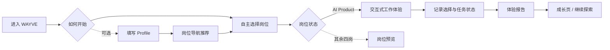
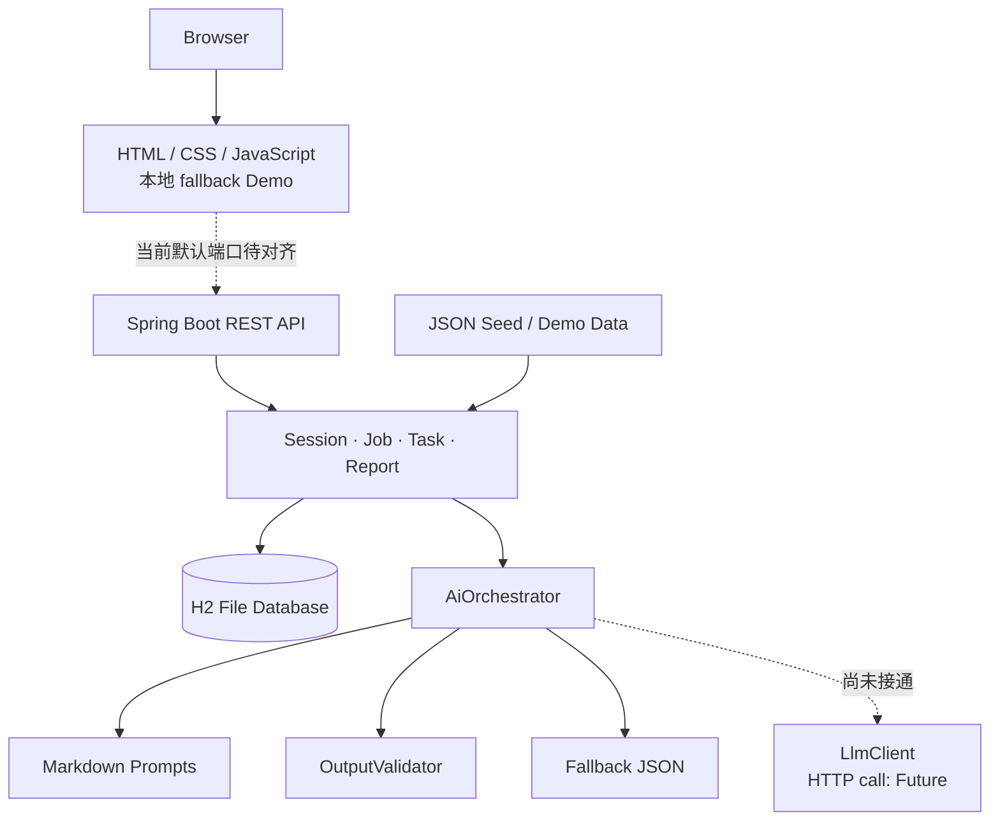

# WAYVE · 试途

<div align="center">


## 仕途之前，先「试途」

**AI Career Explorer · Preview before Commit**

面向学生、职场新人和转行者的职业预体验 Demo：在真正投入学习、求职或转行之前，先完成一段接近真实工作的任务，再根据本次行为证据决定下一步验证什么。

WAYVE 不是性格测试、简历评分器或一次性职业匹配结论。它把职业探索从“读完岗位介绍后猜测自己是否适合”，推进到“先做一段，再基于证据更新判断”。

</div>

---

## 评审 30 秒速览

| 评分维度 | 权重 | 当前仓库可验证的 WAYVE 证据 |
|---|---:|---|
| 问题洞察与价值 | 20% | 聚焦“岗位信息很多、低成本工作体验稀缺”的断层；让用户在高成本职业承诺前先做一次可逆验证 |
| 创新性 | 20% | `Preview before Commit`、`Recommendation ≠ Assessment`、`Evidence over Labels`；用确定性系统守住事实边界，为适合 LLM 的文本任务预留受控接口 |
| 后续发展潜力 | 20% | 岗位、任务、Prompt 与 fallback 均采用可扩展内容结构；Product SOT 已定义 Role Pack、Evidence Replay 与长期探索方向，但未把规划冒充当前功能 |
| Demo 完成度 | 15% | 已有完整网页界面、可选 Profile、五岗导航、AI Product 交互体验、报告与成长页；前端在 API 不可用时可进入本地演示路径 |
| 技术实现能力 | 15% | Java 17 + Spring Boot + JPA + H2；Session / Job / Task / Report REST API、Maven Wrapper、seed、Prompt loader、输出禁用词校验与 fallback 资源均可从代码核验 |
| 展示表达与团队协作 | 10% | README 提供 3 分钟体验路径、架构图、Current / Future 边界和代码证据索引；静态仓库不虚构现场协作成果 |

## 真正的问题：看过 JD，不等于做过这份工作

职业探索工具通常提供更多岗位名称、JD、课程或匹配结果，但用户在投入数月学习、一次实习或一场转行之前，仍很难回答：

- 这份工作每天面对的对象、约束与取舍是什么？
- 我在真实情境中会如何行动，而不只是如何描述自己？
- 一次体验支持什么判断，又有哪些部分尚未被观察？

**职业探索真正缺少的不是更多岗位信息，而是一次低成本、可逆、接近真实工作的体验。**

```text
看 JD → 想象自己是否适合
        ≠
进入任务 → 作出选择 → 留下证据 → 更新判断
```

WAYVE 的价值不是替用户下结论，而是把一个高成本职业决定拆成可以亲自验证的小实验。

## WAYVE 如何工作

下面是当前 Hackathon Demo 的真实路径；虚线节点代表可跳过或只提供预览。



推荐只承担导航作用。Profile、推荐顺序与背景信息不能被写成用户的能力证据；用户可以跳过它们直接探索岗位。

## 四个核心设计选择

### 1. Preview before Commit

普通职业工具往往先要求用户判断“我是谁、我适合什么”；WAYVE 先提供工作体验，再邀请用户决定是否继续投入。它降低的是试错成本，不制造更确定的标签。

### 2. Recommendation ≠ Assessment

岗位推荐回答“可以先看哪里”，不回答“你能力如何”。导航与评估分离，避免把学历、经历或推荐排名偷换成表现证据。

### 3. Evidence over Labels

WAYVE 关注一条可追溯链路：

```text
发生了什么 → 用户做了什么 → 本次证据支持什么 → 还不知道什么
```

未被本次体验观察到的部分是未知，不是低能力；一次短体验也不能支持永久人格、长期潜力或统一 Career Fit Score。

### 4. Deterministic Core + LLM-ready Boundary

当前代码用确定性逻辑管理 Session、任务状态、持久化、seed 和报告演示数据；同时提供 PromptLoader、AiOrchestrator、OutputValidator、LlmClient 配置边界与 fallback JSON。

需要特别说明：**当前 `LlmClient.chat()` 的在线 `chat/completions` HTTP 请求尚未实现。** 因此本仓库不能宣称真实 LLM 已接通；当前 Demo 的稳定路径是确定性逻辑与本地 fallback。未来接入模型时，LLM 只适合承担背景结构化、推荐解释、开放回答证据提取和报告叙事等有限任务，不能改写用户行为与业务事实。

## 当前已经做出来什么

### 可运行的前端体验

- 完整网页入口与响应式视觉界面；
- Optional Profile 与自主选岗两条入口；
- 五个 canonical 岗位导航：AI Product、AI UI Design、AI Operations、AI Data Evaluation、AI Application Development；
- **AI Product** 的交互式体验；
- 其余四岗的岗位预览与“尚在完善”提示；
- 报告页与成长轨迹页；
- API 请求失败后的前端演示降级路径。

### 可运行的后端能力

- 匿名 Session、Profile 保存与会话数据删除；
- 岗位列表与确定性导航推荐；
- 六步 Task Session、回答事件记录、提示与体验反馈；
- 报告生成、读取和目标方向选择；
- Spring Data JPA + H2 文件持久化；
- seed loader、Swagger / OpenAPI 与健康检查；
- Prompt 读取、AI 输出禁用词校验、结构化 fallback 资源。

### 当前不能声称已经完成

- 在线 LLM HTTP 调用；
- 五个岗位全部具备完整交互体验；
- canonical Behavior Event 全量持久化与完整 Evidence Replay；
- Collaboration Sprint / Collaboration Evidence；
- Reflection、Working Portrait 与新版 Integrated Report；
- 多周期 Growth Track、账户体系与生产部署。

这些能力属于 Product SOT 中的 **Future / Post-MVP / migration target**，不是当前运行时事实。

## Quick Start

### 前置环境

- JDK 17
- Git
- 可选：Node.js 18+（只用于启动静态前端服务器）

### 1. 克隆（已有仓库可跳过）

```bash
git clone https://github.com/xiangRose/Wayve.git
cd Wayve
```

### 2. 启动后端

Windows PowerShell：

```powershell
.\mvnw.cmd spring-boot:run
```

macOS / Linux：

```bash
./mvnw spring-boot:run
```

当前 [`application.yml`](src/main/resources/application.yml) 的实际端口是 **3001**：

- Health API：<http://localhost:3001/api/v1/health>
- Swagger UI：<http://localhost:3001/swagger-ui.html>
- H2 Console：<http://localhost:3001/h2-console>

> [`RUN.md`](RUN.md) 中仍保留历史端口 `3000`，应以 `application.yml` 为准。

### 3. 启动前端 Demo

Windows、macOS / Linux：

```bash
npx --yes serve front --listen 5173
```

访问 <http://localhost:5173/>。

当前前端 API 基址仍指向 `localhost:3000`，与后端默认 `3001` 存在已知迁移差异；API 请求失败时前端会进入本地演示路径。因此：

- 评审产品体验可直接使用 `5173` 的 fallback Demo；
- 后端接口与 Swagger 按 `3001` 独立验证；
- 当前 README 不把二者描述为已完成默认联通。

## AI 配置与真实状态

当前 [`application.yml`](src/main/resources/application.yml) 中：

```yaml
app:
  ai:
    enabled: false
    api-key: ${AI_API_KEY:}
    base-url: ${AI_BASE_URL:https://api.openai.com/v1}
    model-pro: ${AI_MODEL_PRO:gpt-4o}
```

仓库真实支持的环境变量名是：

| 变量 | 用途 | 当前是否足以启用在线 LLM |
|---|---|---|
| `AI_API_KEY` | API 凭证 | 否；HTTP 调用仍待实现 |
| `AI_BASE_URL` | OpenAI-compatible API 基址 | 否；仅完成配置绑定 |
| `AI_MODEL_PRO` | 模型名 | 否；仅完成配置绑定 |

仓库当前没有读取 `AI_ENABLED`。Spring Boot 可用 `APP_AI_ENABLED=true` 覆盖 `app.ai.enabled`，但即使开启，`LlmClient.chat()` 仍会返回 `null`，因此**无需 API Key 即可运行的 fallback Demo 才是当前可靠路径**。不要在仓库中提交真实密钥。

## 如果评委只有 3 分钟

1. 打开 `http://localhost:5173/`，从首页理解“先体验，再承诺”。
2. 跳过 Profile，进入“自主选择岗位”，验证推荐不是必经门槛。
3. 选择 **AI Product**；其余岗位当前只做预览。
4. 在交互体验中作出初始判断、查看证据并保留或修订选择。
5. 查看报告页如何呈现本次证据与边界。
6. 进入成长页，理解“继续验证”而非“一次定终身”的产品方向。

若要做技术核验，同时打开 `http://localhost:3001/swagger-ui.html` 查看真实 REST API。

## 技术架构



### 技术栈

| 层级 | 当前实现 |
|---|---|
| Frontend | 原生 HTML、CSS、JavaScript；MVU 交互模块 |
| Backend | Java 17、Spring Boot 3.4.1、Spring Web、Validation |
| Persistence | Spring Data JPA、H2 文件数据库 |
| API | REST、Springdoc OpenAPI 2.7.0、Swagger UI |
| AI boundary | AiOrchestrator、PromptLoader、OutputValidator、LlmClient 配置骨架 |
| Reliability | 确定性业务逻辑、seed、fallback JSON、前端降级路径 |
| Build | Maven Wrapper |

## Code Evidence Index

| 能力 | 仓库证据 | 状态 |
|---|---|---|
| 前端体验 | [`front/index.html`](front/index.html)、[`front/js/app.js`](front/js/app.js)、[`front/js/mvu-core.js`](front/js/mvu-core.js) | Current |
| Session / Profile | [`src/main/java/com/Grassroot/JobSearch/session/`](src/main/java/com/Grassroot/JobSearch/session/) | Current |
| 岗位与推荐 | [`src/main/java/com/Grassroot/JobSearch/job/`](src/main/java/com/Grassroot/JobSearch/job/) | Current；确定性推荐 |
| 六步任务状态 | [`src/main/java/com/Grassroot/JobSearch/task/`](src/main/java/com/Grassroot/JobSearch/task/) | Current |
| 报告 API | [`src/main/java/com/Grassroot/JobSearch/report/`](src/main/java/com/Grassroot/JobSearch/report/) | Current；基于 demo / 持久化数据 |
| AI 编排边界 | [`AiOrchestrator.java`](src/main/java/com/Grassroot/JobSearch/ai/AiOrchestrator.java) | Current scaffold |
| LLM Client | [`LlmClient.java`](src/main/java/com/Grassroot/JobSearch/llm/LlmClient.java) | Future：HTTP TODO |
| Prompt / 校验 | [`AI/prompts/`](AI/prompts/)、[`OutputValidator.java`](src/main/java/com/Grassroot/JobSearch/ai/OutputValidator.java) | Current |
| Fallback | [`src/main/resources/AI/fallbacks/`](src/main/resources/AI/fallbacks/) | Current |
| Seed | [`src/main/resources/seed/`](src/main/resources/seed/) | Current；含 legacy role IDs |
| API 契约 | [`docs/openapi.yaml`](docs/openapi.yaml) | Current 文档；部分场景契约领先于代码 |
| Product SOT | [`WAYVE-Product-PRD.md`](WAYVE-Product-PRD.md)、[`docs/product/`](docs/product/) | Current 产品契约 + Future 设计 |

## 后续发展潜力

以下是待验证的产品与商业假设，不是已经取得的用户或收入成果。

### 1. 从一个体验扩展为 Role Pack

岗位定义、任务内容、Prompt 与 seed 已按内容资源拆分。后续可为更多 AI 岗位乃至非 AI 岗位增加独立 Role Pack，而不是重写整套产品。

### 2. 从一次体验扩展为连续证据

单次任务只能描述本次观察。多个独立 Work Sample、Evidence Replay 与 reviewed Next Mission 可以逐步形成纵向探索记录，让用户比较“不同情境中的表现如何变化”，而不是累积一个静态标签。

### 3. 可验证的使用场景

- 高校职业教育：课程前的岗位预体验与课后反思；
- Career Sprint：用一组短工作样本降低转行研究成本；
- 企业内部流动：让员工先体验相邻岗位，再决定是否申请轮岗；
- 个人持续探索：围绕证据缺口规划下一次学习或实践。

### 4. 商业化假设

潜在方向包括面向个人的深度 Role Pack、面向学校的职业探索课程工具，以及面向组织的内部岗位体验方案。仓库中没有付费、留存或商业闭环数据，因此这些只能作为后续验证方向。

## 产品边界

WAYVE 主动约束自己不做以下事情：

- 不生成永久人格、稳定特质或长期潜力判断；
- 不用一次任务宣布用户“适合 / 不适合”某个职业；
- 不创建 Unified Career Fit Score 或变体；
- 不把 `not_observed` 渲染成低分；
- 不把 Profile、推荐排名、学校或公司声望混入能力判断；
- 不使用健康数据做职业判断；
- 不把产品用于自动招聘淘汰；
- 不允许 AI 发明用户没有做过的行为。

最终职业决定权始终属于用户。

## Current Scope 与 Future Scope

| Current：当前 Hackathon 代码可验证 | Future / Post-MVP：产品演进方向 |
|---|---|
| 五岗导航；AI Product 可交互，其余四岗预览 | 五岗完整且各自独立的 Work Sample |
| Profile、确定性推荐、Session 与六步 Task API | Recommendation 与 Assessment 的 canonical 全链路迁移 |
| 任务状态、回答事件、反馈与 H2 持久化 | canonical Behavior Event 与 requirement-level evidence |
| 基于 demo / 持久化数据的报告与前端成长页 | 完整 Evidence Replay、Working Portrait、Reflection |
| Prompt / Validator / fallback 与 LLM 配置骨架 | 在线 LLM 调用与经过验证的结构化输出链路 |
| 前后端可分别演示，默认端口尚待对齐 | 默认一键联通、账户体系与生产部署 |
| 单次体验 | 多次独立实验与长期 Growth Track |

## Repository Structure

```text
Wayve/
├── front/                       # 网页 UI、MVU 交互与本地资源
├── src/main/java/.../
│   ├── ai/                      # 编排、Prompt 读取、校验、seed loader
│   ├── llm/                     # LLM 配置与客户端骨架
│   ├── session/                 # 匿名会话与 Profile
│   ├── job/                     # 岗位与导航推荐
│   ├── task/                    # 六步任务状态与反馈
│   └── report/                  # 报告持久化与 API
├── src/main/resources/
│   ├── AI/fallbacks/            # 本地结构化 fallback
│   ├── seed/                    # 岗位、任务与演示数据
│   └── application.yml          # 当前运行配置
├── AI/prompts/                  # 可审阅的 Prompt
├── docs/product/                # Product SOT 分层文档
├── docs/openapi.yaml            # API 契约
├── WAYVE-Product-PRD.md         # 产品整合视图
└── pom.xml                      # Java / Spring Boot 版本与依赖
```

---

<div align="center">

**WAYVE · 让职业选择从“听说”变成“试过”。**

</div>
